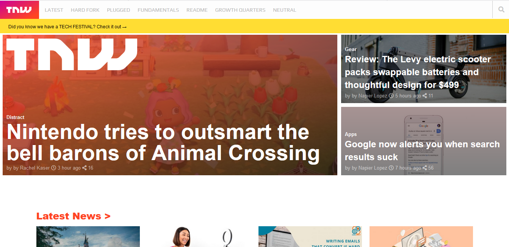

# The Next Web 

> This is a clone of a website which post the latest news all arround the world.

## Built With

- HTML,
- CSS

## Live Demo

[Live Demo Link](https://rawcdn.githack.com/haraphat01/thenextweb/7be8bfcd51be9652837f84ecaf83ef35543dc5ee/index.html)

## Authors

👤 **Author1**

- Github: [@tGodson](https://github.com/tGodson/)
- Twitter: [@tendongze95](https://twitter.com/tendongze95)
- Linkedin: [linkedin](https://www.linkedin.com/in/tendongze-godson-a95795163/)

👤 **Author2**

- Github: [@haraphat01](https://github.com/haraphat01)
- Twitter: [@haraphat01](https://twitter.com/haraphat01)
- Linkedin: [linkedin](https://www.linkedin.com/in/arafat-akata/)

## 🤝 Contributing

Contributions, issues and feature requests are welcome!

Feel free to check the [issues page](https://github.com/haraphat01/thenextweb/issues).

## Show your support

Give a ⭐️ if you like this project!

## Acknowledgments

- Arafat
- Godson

## 📝 License

This project is [MIT](lic.url) licensed.
